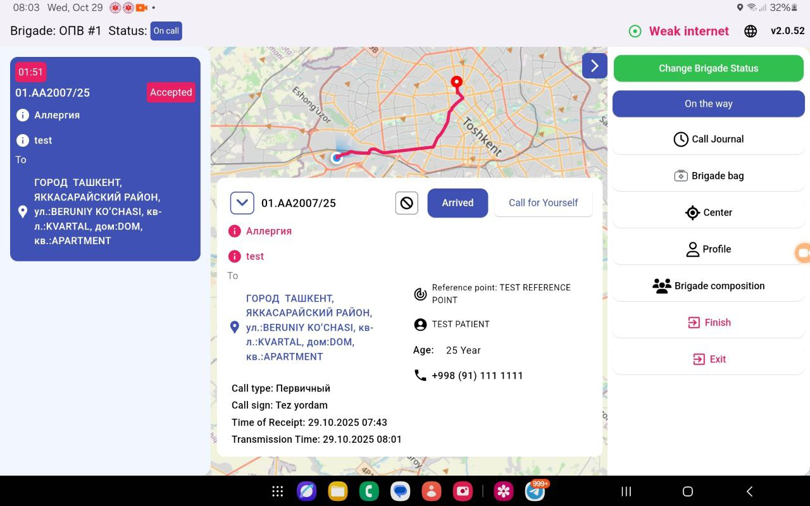
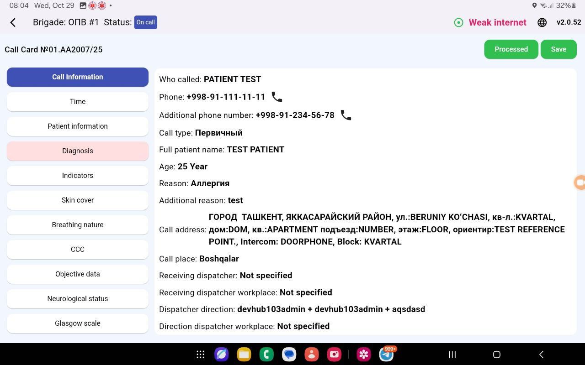
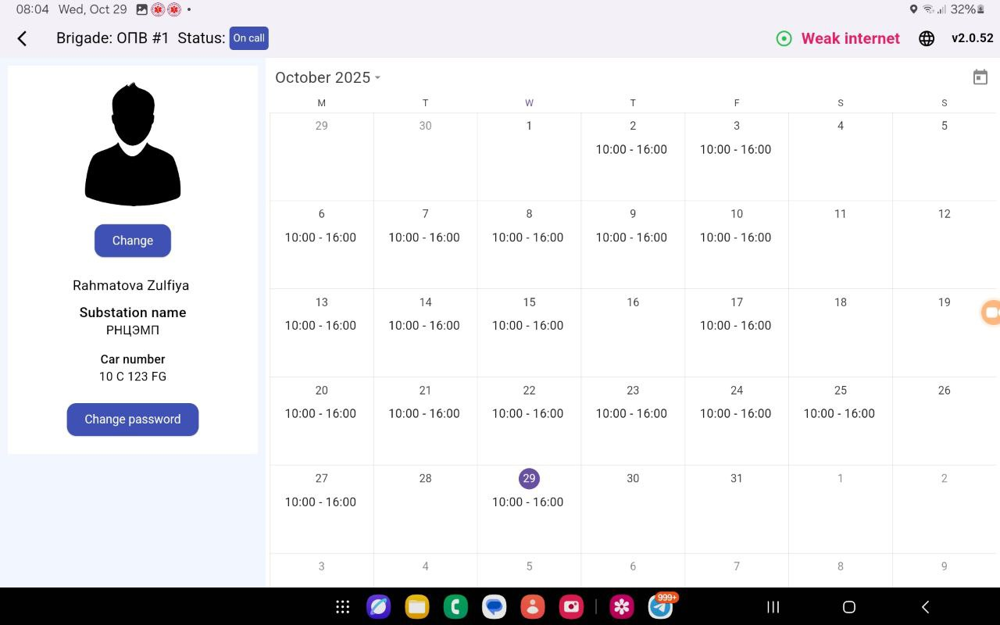
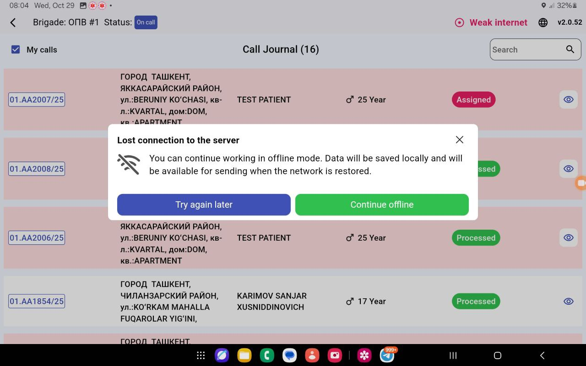

# 🚑 103 UDS Mobile Application

> **Disclaimer:** ⚠️ This is a **showcase** of the project. The source code is **private and confidential** due to the project’s privacy policy. The materials shown here are for demonstration purposes only.

---

## Project Overview

The **103 UDS Mobile Application** is part of Uzbekistan's **112 Unified Dispatching System (UDS)**, which handles various emergency services such as:  

- **101** – Fire and Rescue (Firefighters) 🔥  
- **102** – Police / Law Enforcement 👮‍♂️  
- **103** – Ambulance / Medical Emergencies 🚑 (this app)  
- **104** – Gas Emergencies / Gas Leaks ⛽  

This tablet-only application is designed specifically for **103 medical staff (doctors/medics)**. Before this app, medics recorded patient calls on paper, which was inefficient and prone to errors. With this application, medics can receive, manage, and respond to emergency calls digitally, improving response efficiency across the country.  

Dispatchers receive emergency calls via a **web platform** and create **control cards** for each patient. These control cards are sent to medics via **SignalR** in real-time, enabling medics to accept the calls, view patient location, navigate the optimal route, and manage patient treatment digitally.

---

## Key Features ✨

- **Emergency Call Handling** 📞
  - Medics receive emergency calls in real-time.
  - Acceptance is required for every assigned call.
- **Location & Navigation** 🗺️
  - View patient location on a map.
  - Optimal route guidance to the patient.
  - Hospital navigation for patient transport.
- **Medical Forms** 📝
  - Fill patient info, diagnosis, and medication/tool usage.
  - Record hospitalization details.
- **Speech-to-Text** 🎙️
  - Convert medic’s voice notes into text.
- **Offline Mode** 📡
  - Medics can view, edit, and delete data offline.
  - Automatic synchronization when internet is restored.
- **Custom UI Features** 🖌️
  - Animated map popup showing user location.
---

## Tech Stack 🛠️

- **Flutter** – Cross-platform mobile development  
- **OAUTH2** – Secure authentication with `accessToken` and `refreshToken`  
- **Firebase Cloud Messaging (FCM)** – Push notifications for emergency calls  
- **SignalR** – Real-time communication between dispatchers and medics  
- **Dio** – Network API calls  
- **Hive** – Offline storage and synchronization  
- **Melos** – Multi-repo structure  
- **Bloc & Cubit** – State management  
- **Clean Architecture** – Layered, maintainable code structure  
- **FlutterMap & UZGPS Integration** – Mapping and routing functionalities  

---

## Demo & Screenshots 🎬

**Screenshots of the app in action:**

1.   
2.   
3.   
4. 

**Video Demo:**  
[Watch the demo video](your_video_url) – *Note: This video is in test mode for demonstration purposes only.*

---

## Team 👥

Developed by **BePro DevHub Team** – [LinkedIn](https://www.linkedin.com/company/bepro-devhub/people/) | [Website](https://devhub.uz/)  
This project was developed with a cross-functional team of **mobile, web, and backend developers**. I contributed as a **mobile developer**, focusing on the tablet application for medics.

---

## Notes 📝

- This project is **internal and confidential**. The code is **not publicly available** due to privacy regulations.  
- Demo materials are **showcase-only** and do not contain real patient data.  

---

## Future Improvements / Roadmap 🚀

- AI-assisted patient triage recommendations.  
- Advanced predictive routing for faster response times.  
- Enhanced offline conflict resolution for multi-user edits.  
